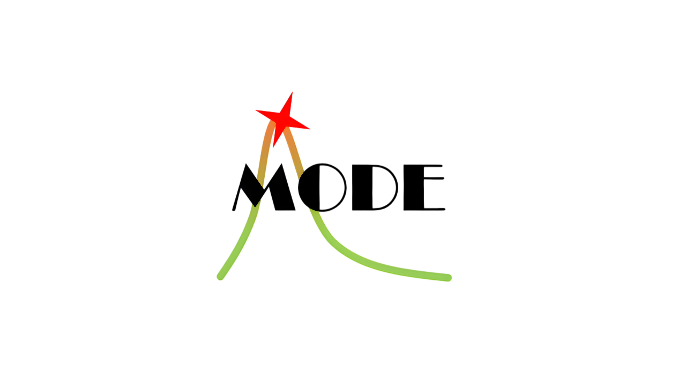

---
hide:
  - navigation
  - toc
---

  <h1 style="margin: 0;">
    Machine-learning Optimized Design of Experiments
  </h1>
  

MODE (for **Machine-learning Optimized Design of Experiments**) is a collaboration of physicists and computer scientists who target the use of differentiable programming in design optimization of detectors for particle physics applications, extending from fundamental research at accelerators, in space, and in nuclear physics and neutrino facilities, to industrial applications employing the technology of radiation detection.

We aim to develop modular, customizable, and scalable, fully differentiable pipelines for the end-to-end optimization of articulated objective functions that model in full the true goals of experimental particle physics endeavours, to ensure optimal detector performance, analysis potential, and cost-effectiveness.

The main goal of our activities is to develop an architecture that can be adapted to the above use cases but will also be customizable to any other experimental endeavour employing particle detection at its core. We welcome suggestions, as well as interest in joining our effort, by researchers focusing on use cases for which this technology can be of benefit.

The above program is supported as an expression of interest by the JENAA group:

- Expression of interest: http://www.pd.infn.it/%7Edorigo/eoi_jenas.pdf
- JENAA group: http://nupecc.org/jenaa/?display=eois

## Mailing list

If you are interested in information about MODE (including, but not limited to, the announcement of our yearly workshop and the opening of MODE-related PhD/postdoc positions), or if you want to post such advertisement yourself, you can join our **mode-info** mailing list:

- https://e-groups.cern.ch/e-groups/Egroup.do?egroupId=10710684
