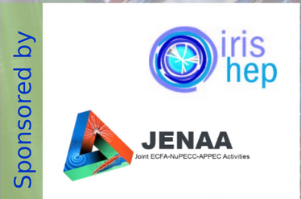

---
hide:
  - navigation
  
---

# MODE Workshop Series

## Differentiable Programming for Experiment Design

Welcome to the reference page for the **MODE Workshop series on Differentiable Programming for Experiment Design**, organized by the MODE Collaboration.

---

## Fifth MODE Workshop on Differentiable Programming for Experiment Design

**When**
June 9–13, 2025

**Format & Location**
Hybrid (in-person and online)
Orthodox Academy of Crete (OAC)
Kolymbari Kissamos, ZIP 730 06
Chania, Crete, Greece

**Event page**
➡️ https://indico.cern.ch/event/1481852/

---

## Fourth MODE Workshop

**When**
September 23–25, 2024

**Format & Location**
Hybrid (in-person and online)
University of Valencia and IFIC
Valencia, Spain

**Scientific material**
➡️ https://indico.cern.ch/event/1380163/

---

## Third MODE Workshop

**When**
July 24–27, 2023

**Format & Location**
Hybrid (in-person and online)
Princeton, NJ, USA

**Scientific material**
➡️ https://indico.cern.ch/event/1242538/

---

## Second MODE Workshop

**When**
September 12–16, 2022

**Format & Location**
Hybrid (in-person and online)
Orthodox Academy of Crete (OAC)
Kolymbari Kissamos, ZIP 730 06
Chania, Crete, Greece

**Scientific material**
➡️ https://indico.cern.ch/event/1145124/

---

## First MODE Workshop

**When**
September 6–8, 2021

**Format & Location**
Hybrid (in-person and online)
CP3, Université catholique de Louvain
Chemin du Cyclotron 2
B-1348 Louvain-la-Neuve, Belgium

**Scientific material**
➡️ https://indico.cern.ch/event/1022938/

---

## Scientific Advisory Committee

- Kyle Cranmer — New York University (HEP/ML)
- Julien Donini — Université Clermont Auvergne (HEP)
- Andrea Giammanco — Université catholique de Louvain (HEP / Muon Tomography)
- Atilim Gunes Baydin — University of Oxford (Computer Science)
- Piero Giubilato — University of Padova (Hadron Therapy)
- Gian Michele Innocenti — CERN (Nuclear Physics / ML)
- Michael Kagan — SLAC (HEP / Computer Science)
- Riccardo Rando — University of Padova (Astro-HEP)
- Roberto Ruiz de Austri Bazan — IFIC Valencia (Astro-HEP)
- Kazuhiro Terao — Columbia University (Neutrino / ML)
- Andrey Ustyuzhanin — Higher School of Economics, Moscow (Computer Science)
- Christoph Weniger — University of Amsterdam (Astro-HEP)

---

## Sponsors

The MODE Workshops are sponsored by **JENAA** and **IRIS-HEP**.
We sincerely thank both organizations for their generous support.

---

## Code of Conduct

All MODE Workshops abide by the
➡️ **IRIS-HEP Code of Conduct**
https://iris-hep.org/about/code-of-conduct

Complaints can be sent to any member of the MODE Workshop organizing committee
